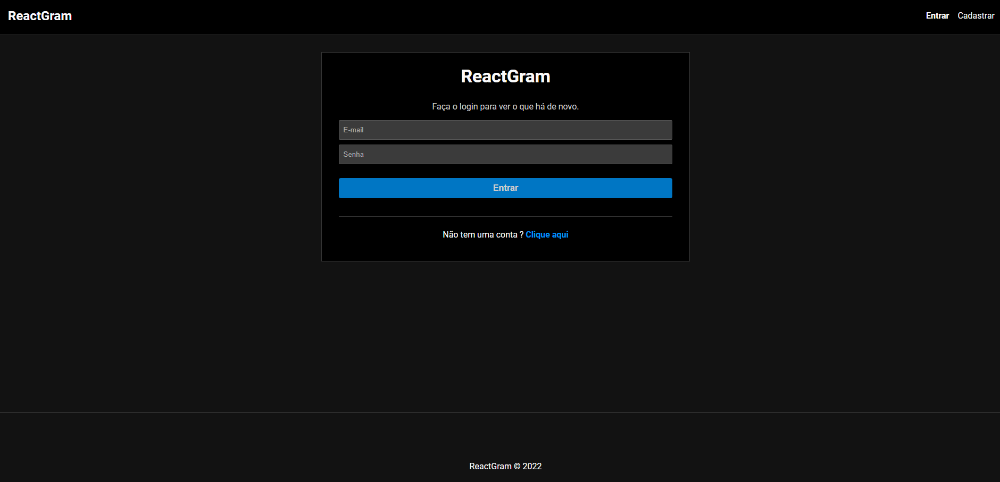
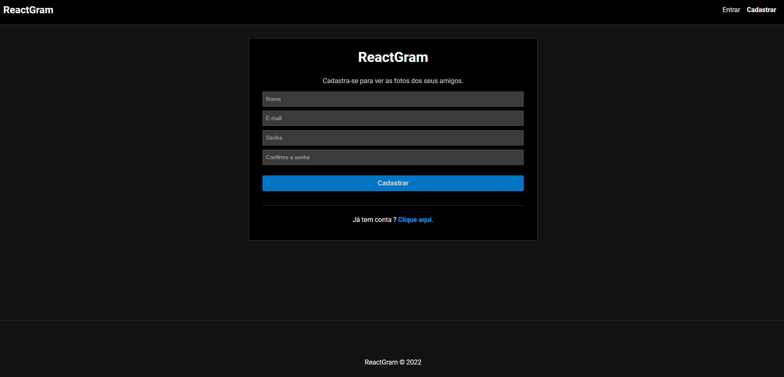
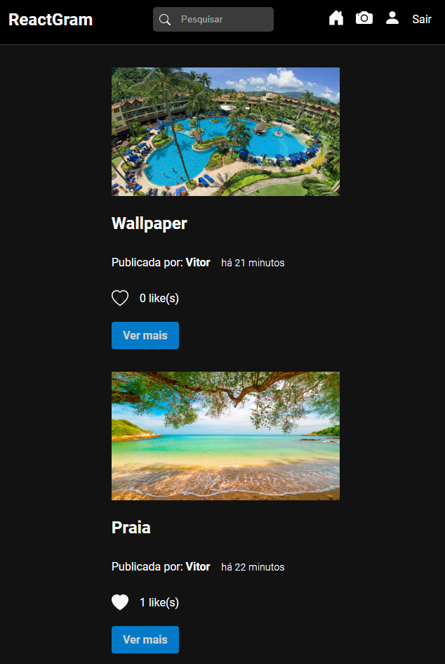
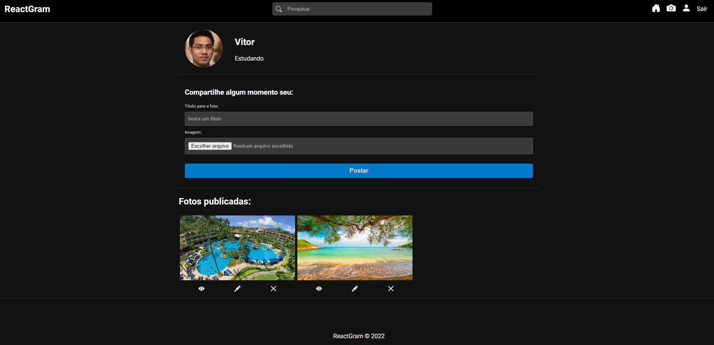
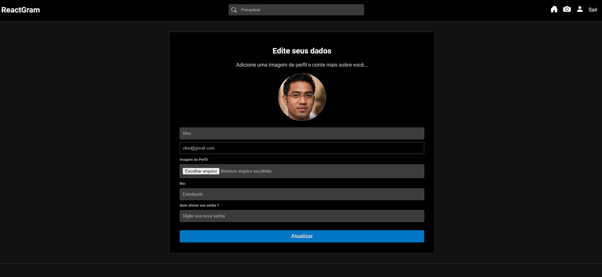

# ReactGram

## :computer: Sobre o Projeto

ReactGram é um aplicação web baseado em algumas funcionalidades do Instagram.

O projeto possui um sistema de autenticação, onde os usuários podem se
cadastrar ou realizar o login (caso já possuir um cadastrado autenticado).

Feito a autenticação, os usuários podem visualizar as postagens mais recentes no feed, curtir e comentar cada post. Ou se o usuário
preferir, pode fazer um busca do post por título.

Para publicar um post, é necessário inserir um título e uma imagem jpg, png ou jpeg. Também é possível visualizar, editar e excluir cada post publicado.

Na página de perfil, o usuário pode inserir uma foto, escrever sua biografia e trocar sua senha. Não sendo permitido editar o e-mail.

<p align="center"><em>Confira o resultado em: <a href="https://reactgram-vitor.vercel.app/" target="_blank">reactgram-vitor.vercel.app</a></em></p>

## Imagens

<div>
   
   
   
   
   
</div>

## :rocket: Techs

<ul>
  <li> React </li>
  <li> CSS3 </li>
  <li> ReactJS </li>
  <li> Redux </li>
  <li> Redux Toolkit </li>
  <li> React Router </li>
  <li> Moment.js </li>
  <li> Node.js </li>
  <li> Express </li>
  <li> MongoDB </li>
  <li> Mongoose </li>
  <li> jsonwebtoken </li>
  <li> multer </li>
  
</ul>

## Desenvolvimento

---

### Pré-requisitos

- Instalar [Node.js](https://nodejs.org)

### Clone o repositório

```bash
$ git clone https://github.com/vitorgaletti/reactgram
```

### Executar Projeto

```bash
# Mudar para directório
$ cd reactgram/
```

#### Front-End

```bash
# Mudar para directório
$ cd frontend/
```

- Instalar dependências

```bash
$ npm install
```

- Execute

```bash
$ npm run start
```

- Executar scripts

|           Ação            |   Utilização    |
| :-----------------------: | :-------------: |
| Iniciar o desenvolvimento | `npm run start` |
|  Compilar para produção   |   `npm build`   |

#### Back-End

```bash
# Mudar para directório
$ cd backend/
```

- Instalar dependências

```bash
$ npm install
```

- Execute

```bash
$ npm run server
```

- Executar scripts

|          Ação          |    Utilização    |
| :--------------------: | :--------------: |
|   Iniciar o servidor   | `npm run server` |
| Compilar para produção |   `npm build`    |

## Autor

- [@vitorgaletti](https://github.com/vitorgaletti)
